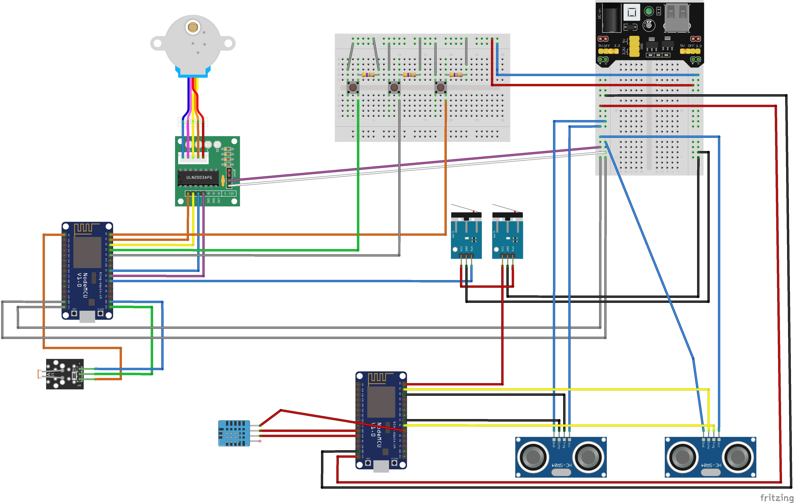

# Anta domotica

Il progetto consiste nel progettare un'anta domotica la quale si apre/chiude in base alla presenza di luce diretta oppure tramite input esterni (bottoni o messaggi di rete). 
L'idea di base nasce dal fatto che il mio ufficio al mattino rimane all'ombra mentre, negli orari pomeridiani, il sole punta diretto all'interno rendendomi difficoltoso il lavoro da pc.

L'apertura o chiusura può essere comandata in due modi:
- <b>automatico</b>: lo stato dell'anta viene deciso automaticamente in base alla presenza di luce diretta (valutata dalla fotoresistenza) ed in base all'orario corrente. Quest ultimo può servire nel caso in cui l'utente voglia che da un certo orario serale fino ad un certo orario alla mattina, le ante rimangano chiuse.

- <b>manuale</b>: lo stato dell'anta può essere modificato tramite la pressione dei bottoni fisici collegati direttamente alla board oppure tramite l'invio di messaggi con il protocollo mqtt.

Ogni qualvolta l'anta si muove, viene attivato (in base a se si sta aprendo o chiudendo) il rispettivo sensore di prossimità, necessario per controllare che non ci sia alcun ostacolo nel raggio di movimento. Qualora il sensore rilevasse un ostacolo il movimento verrà bloccato. Questo tipo di controllo non avviene nel primo movimento di assestamento dell'anta, attenzione quindi che l'intero raggio d'azione sia libero per questo istante.

Per rilevare l'arrivo dell'anta a destinazione, sono stati posti due finecorsa (uno per l'apertura ed uno per la chiusura).

È inoltre presente un sensore di temperatura ed umidità, utilizzato per raffinare il calcolo della distanza calcolato dai sensori di prossimità.

## Messaggi mqtt
Di seguito i messaggi mqtt utilizzati (prefisso generale `antaDomotica/aubbiali`):

### Subscription

- sensor
    ```
    /doorMovement
    payload:
        - DS_STOP -> stop distance sensor
        - ACTIVATE_DS_CLOSE -> activate distance sensor close
        - ACTIVATE_DS_OPEN -> activate distance sensor open
    ```

- movement
    ```
    /moveDoor
    payload:
        - "close" -> close the door (if manual)
        - "open" -> open the door (if manual)

    /setManual
    payload:
        - "1" -> set manual true
        - "0" -> set manual false

    /distanceSensor
    payload:
        - DS_ACTIVATED -> received distance sensor activated

    /setCloseTime
    payload:
        - "time" -> set the close time (hh)

    /setOpenTime
    payload:
        - "time" -> set the open time (hh)
    ```

### Publish

- sensor
    ```
    /distanceSensor
    payload:
        - DS_ACTIVATED -> send signal distance sensor activated

    /temperature
    payload:
        - string -> temperature value

    /humidity
    payload:
        - string -> temperature value
    ```

- movement
    ```
    /doorStatus
    payload:
        - "close" -> the door is closed
        - "open" -> the door is open

    /doorMovement
    payload:
        - "close" -> send the close signal
        - "open" -> send the open signal

    /closeTime
    payload:
        - "hours" -> send the close hours

    /openTime
    payload:
        - "hours" -> send the open hours

    /isManual
    payload:
        - bool -> send is manual value

    /photoResistenceResp
    payload:
        - string -> send photoresistence response 

    ```

## Circuito



## Valori di default

Se non settati dalle `constant.h` l'anta si chiuderà alle 22 e si aprirà alle 6 di defaul

## Logica automatica:

L'obiettivo è chiudere l'anta a prescindere la sera e riaprirla (qualora non ci sia il sole diretto) la mattina:

photoresistence -> close        time -> open   = close\
photoresistence -> open         time -> close  = close\
photoresistence -> open         time -> open   = open\
photoresistence -> close        time -> close  = close

<b> !ATTENTION! </b>
At the moment, for implementation behaviour, close time must be > of the open time.
So for example
```
open-time: 06:00
close-time: 23:00
```

## Photoes


 
https://user-images.githubusercontent.com/44111217/206721258-0ae9b58c-8fa4-4f94-9945-c57a270a05e9.mp4

https://user-images.githubusercontent.com/44111217/206721718-c84176ce-9c02-403d-8d9d-294fac7fad00.MP4
 

# TODO

- utilizzare task scheduler invece di loop nelle varie funzioni del codice
- utilizzare una sola board
- sistemare il circuito in modo tale da sapere se il blocco del movimento dell'anta è causato da switch open, switch close o ostacolo trovato. Non utilizzare più quindi la connessione in serie dei componenti board-switch1-switch2.
- sistemare le funzioni che hanno dei timeout interni (per esempio la funzione pulseIn, se non erro, aspetta il ritorno del segnale per un tot di tempo, ti tiene ferma la computazione per quel tot di tempo).


